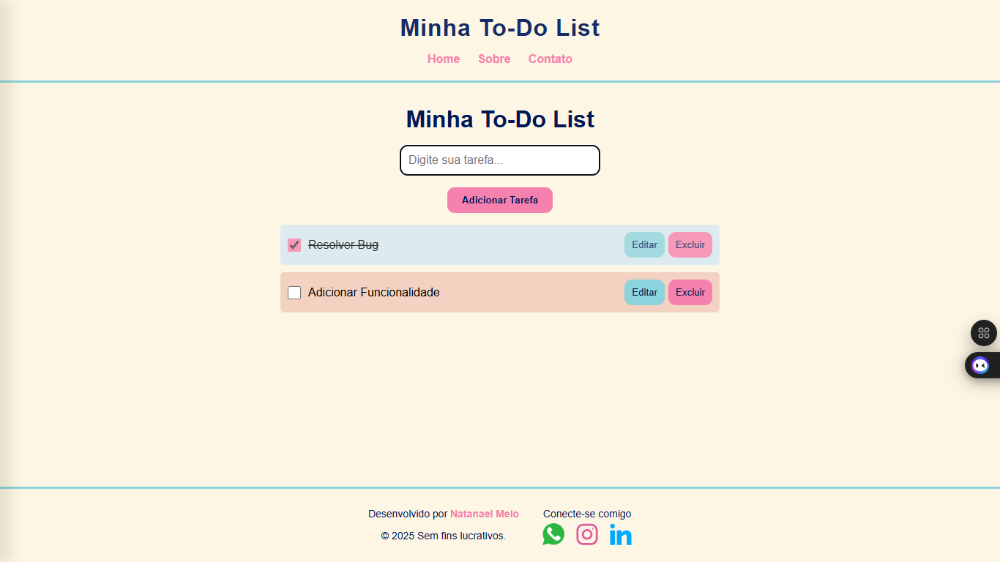

# To-Do List Interativa 🚀

Uma aplicação de lista de tarefas moderna com persistência local, desenvolvida com React.



## ✨ Funcionalidades

- ✅ Adicionar novas tarefas
- ✏️ Editar tarefas existentes
- 🗑️ Excluir tarefas
- ✔️ Marcar tarefas como completas
- 📱 Design responsivo
- 💾 Persistência no localStorage
- 🎨 Estilização personalizada com tema consistente
- 🔗 Links de redes sociais no footer
- 🧭 Navegação básica no header

## 🎮 Como Usar

### Adicionar Tarefa
- Digite no campo de texto  
- Pressione **Enter** ou clique em **"Adicionar Tarefa"**

### Marcar como Completa
- Clique no **checkbox** ou no texto da tarefa

### Editar Tarefa
1. Clique no botão **"Editar"**
2. Modifique o texto
3. Clique em **"Salvar"** ou pressione **Enter**

### Excluir Tarefa
- Clique no botão **"Excluir"**

---

## 🎨 Estilização
A aplicação utiliza uma paleta de cores suaves e harmoniosas:
- **Cor principal:** `#f582ae` (rosa salmão)
- **Cor secundária:** `#8bd3dd` (azul claro)
- **Fundo:** `#fef6e4` (bege claro)
- **Texto:** `#001858` (azul marinho)

*Os componentes são estilizados com `styled-components` seguindo um design system consistente.*

---

## 📱 Responsividade
O layout se adapta a diferentes tamanhos de tela:
- ➿ Header e Footer com disposição flexível
- 📋 Itens da lista ajustáveis
- 📲 Botões com tamanho otimizado para mobile


## 🛠️ Tecnologias Utilizadas

- React
- Styled Components
- Vite
- LocalStorage

## 🚀 Como Executar

1. **Clone o repositório**
   ```bash
   git clone https://github.com/seu-usuario/todo-list.git
   ```
2. **Instale as dependências**
   ```bash
   npm install
   ```
3. **Execute o servidor de desenvolvimento**
   ```bash
   npm run dev
   ```
4. **Acesse no navegador**
   ```bash
   http://localhost:5173
   ```

## 📄 Licença
Este projeto está licenciado sob a **Licença MIT** 
